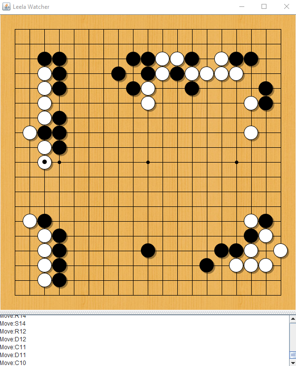

# LeelaWatcher
A GUI for watching Leela Zero self train.

LeelaWatcher provides the following features:

1. Executes [Leela Zero](https://github.com/gcp/leela-zero)'s autogtp cooperative training mode
1. Parses the standard output from the training sesion to extract the moves
1. Displays the moves on a graphical board
1. When the game ends, writes it out to an SGF file named for the timestamp of when the game ended.

# Running
Before you can use the LeelaWatcher you must first obtain a current copy of Leela Zero and the autogtp program that comes with it. Instructions can be found on the [Leela Zero](https://github.com/gcp/leela-zero) site.

You will also need to install the [Java Runtime Environment](http://www.oracle.com/technetwork/java/javase/downloads/jre8-downloads-2133155.html)

After you have Java, Leela Zero and autogtp, you can run the latest version of LeelaWatcher ([found here](https://github.com/barrybecker4/LeelaWatcher/releases)) or build it locally with `.gradlew assemble`. If you choose to build locally, then the jar can be found in the build/libs directory.

On Linux (what I use) the command looks like this

    java -jar LeelaWatcher-1.2.0.jar /home/gus/leelaz/leela-zero/autogtp/
    
Mac should be similar. For those not familiar with java, what that line does is it invokes java and instructs it to run the code found in LeelaWatcher.jar. Everything after LeelaWatcher.jar is passed to the program as [arguments](https://en.wikipedia.org/wiki/Command-line_interface#Arguments)

Two arguments are possible, the first one is the location where LeelaWatcher will search for the autogtp program, the second is optional, but if supplied it will be interpreted as the name of the autogtp program file (the compiled executable that you created when you built auto gtp). This second argument is usually only needed on Windows. 

Here's a Windows example, that assumes that your autogtp is in a folder named `D:\My Folders\Downloads\leela-zero-0.4-window` :

    C:>java -jar LeelaWatcher-1.2.0.jar D:\My Folders\Downloads\leela-zero-0.4-windows autogtp.exe

or alternately 

    C:> cd D:\My Folders\Downloads\leela-zero-0.4-windows
    D:\My Folders\Downloads\leela-zero-0.4-windows>java -jar LeelaWatcher-1.2.0.jar . autogtp.exe
    
Note that the '.' in the second example is a symbol that means "the current directory." Also if I've messed up the Windows example let me know by filing an issue with an example of the corrected command line(s). I don't use Windows very much, and haven't actually run my program there.

Additional command line options can be seen by passing `--help` or `-h`

    java -jar ~/projects/LeelaWatcher/LeelaWatcher/build/libs/LeelaWatcher-1.2.0.jar --help 
    
    Start a LeelaWatcher instance. A prefix of java -jar is presumed for all
    usage below. <dir> specifies where to find autogtp and <cmd> allows
    overide of default './autogtp' command (windows users need to specify
    an exe for example)
    
    Usage:
     LeelaWatcher-1.2.0-SNAPSHOT.jar [--help] [options] <dir> [<cmd>]
    
    Options:
      --no-sgf        Don't save an sgf file for each game
      --board-only    Don't show output window and other diagnostic features.
      --help -h       Print detailed help message
